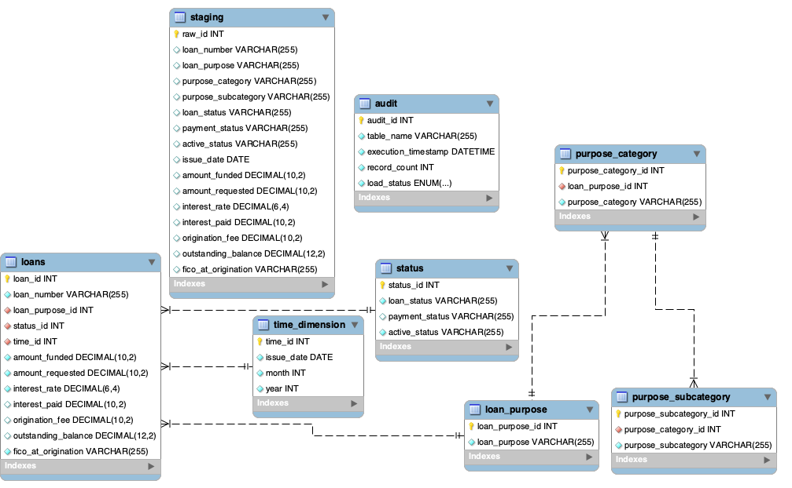

# 💳 Loan Risk Data Warehouse & ETL Pipeline

A complete MySQL-based ETL pipeline for modeling and managing loan-related data, with automated loading procedures and visual analytics integration.

---

## 📁 Repository Structure

```
loan-risk-etl/
├── sql/
│   ├── Creating.sql                # Create database, dimensions, facts, and audit table
│   ├── Staging.sql                 # Create staging table and load raw CSV data
│   └── Loading.sql                 # Stored procedure for ETL process with audit tracking
├── assets/
│   ├── ERD.png
│   ├── Borrower Profile and Credit Risk Characteristics.png
│   └── Loan Portfolio Overview and Risk Exposure.png
└── README.md
```

---

## 🧱 Project Overview

This project demonstrates how to design and implement a relational data warehouse for loan data using MySQL. It includes:

- A fully normalized **dimensional schema** (star model) with dimension and fact tables  
- A **staging layer** for raw CSV ingestion  
- A **stored procedure** to automate data transformation and loading with built-in error handling and auditing  

The pipeline supports analysis of borrower profiles, loan performance, purpose distribution, and more.

---

## ⚙️ SQL Scripts

1. **Creating.sql**  
   Creates database `loan_risk` and defines all dimension tables, fact table `loans`, and audit table `audit`.

2. **Staging.sql**  
   Creates the staging table `staging` and loads raw data from CSV using `LOAD DATA LOCAL INFILE`.

3. **Loading.sql**  
   Defines and calls stored procedure `load_data_to_model()` to perform transformation and loading from `staging` into the dimensional model, with load tracking via the `audit` table.

---

## 🗺️ Data Model

The following ERD illustrates the star schema design:



---

## 📊 Sample Visualizations

This database can be connected to tools like Tableau for further insights. Below are example dashboards built from this data:

> **Note:**  
> The second dashboard, *Borrower Profile and Credit Risk Characteristics*, is based on an external dataset and is not directly derived from this database. It is provided to complement the first dashboard and assist with exploring the underlying drivers behind observed risk patterns.

<p align="center">
  <strong>Loan Portfolio Overview and Risk Exposure</strong><br>
  
</p>

<p align="center">
  <strong>Borrower Profile and Credit Risk Characteristics</strong><br>
  
</p>

---

## 🛠️ Tech Stack

- **MySQL**: Schema design, data modeling, and stored procedures  
- **MySQL Workbench**: Visual modeling and SQL execution  
- **Tableau**: Dashboard creation (optional extension)

---

## 📌 Notes

- All SQL scripts follow a clean separation of layers: creation, staging, and ETL loading.  
- The audit mechanism helps log successes or failures at each data load stage.  
- Visualization is provided as an optional extension and not the project focus.

---

## 🔗 Author

Developed by Thomas Jin | Mar 2025
